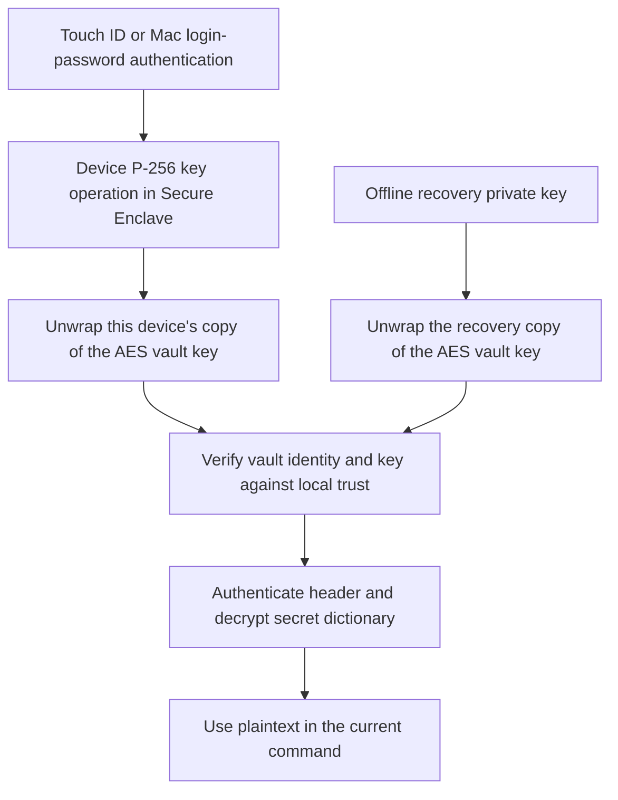

# Security and key management

This describes the current mop implementation, including the local vault-trust
checks. It explains both the protections and their boundaries; it is not an
independent security audit. See [validation](VALIDATION.md) for executed checks
and remaining hardware and multi-Mac acceptance tests.

## What protects a secret

mop encrypts the complete reference/value dictionary with a random 256-bit AES
key. Each enrolled device has its own Secure Enclave P-256 private key. The vault
contains a separately encrypted copy of the AES key for each device and for one
offline recovery key. This is **envelope encryption**: device keys protect the
vault key, and the vault key protects the data.



The diagram shows the cryptographic paths. The `vault recover` CLI additionally
requires local authentication to initialize or unlock the replacement device key.
The recovery credential itself is a portable decryption capability: someone with
it and the encrypted vault can decrypt with other software without your original
Mac, Touch ID, or mop's local trust policy.

The Mac login password authorizes use of the hardware key. It is not used to
derive the vault's AES key, and fingerprint scans are not encryption keys.

## Keys and files

Paths below are defaults. `--vault-file` / `MOP_VAULT_FILE` choose the vault;
`--state-directory` / `MOP_STATE_DIRECTORY` choose local state.

| Material | Location and purpose | Handling |
|---|---|---|
| Encrypted vault | `~/.mop/.mopfile`; ciphertext, authenticated header, recipient public keys, and wrapped AES keys | May live in iCloud Drive. Everyone enrolled can access the entire file. |
| AES vault key | Random 32-byte key, stored only in wrapped form in the vault; unwrapped in command memory | Never stored persistently in plaintext by mop. Rotated when a device is removed. |
| Device private-key representation | `~/.mop/device.json`; opaque hardware-wrapped blob, public key, and device name | Keep local, owner-only, and preserve across upgrades. Not portable to another Mac. |
| Local trust records | `~/.mop/trust/`; active and previous commitments to vault identity/key, indexed by canonical path | Keep local, outside cloud sync. Contains no decryption key, but its integrity matters. |
| Recovery private key | File chosen at `vault init`; an exportable P-256 private key encoded as `mop-recovery-v1:` plus Base64 | Keep offline, separate from synced ciphertext. Base64 is not encryption. Save a verified vault fingerprint with it. |
| Device enrollment request | File chosen by `device request --out`; device name and public key | Not secret. Verify its fingerprint independently before granting access. |
| Encrypted history | `.mopfile.history/` beside the selected vault, with content-hash filenames | Sync/back up with the vault. Contains old secrets and old wrapped keys; not automatically pruned. |

The device key is **protected by** the Secure Enclave, not stored as a permanent
standalone record inside it. CryptoKit provides an opaque representation that mop
saves on disk; only the issuing hardware can use the protected key. Losing that
representation, resetting the relevant hardware state, or losing the Mac can make
that device key unusable. A backup of the blob is not a replacement for recovery
on another Mac. Apple's [key-representation explanation](https://developer.apple.com/forums/thread/786223)
also clarifies that the blob does not intrinsically restrict use to one app ID.

mop creates private files with mode `0600` and private state directories with
owner-only permissions. It clears inherited ACLs before writing private file
contents; private reads/directories also check ownership, mode bits, symlinks,
and reject ACL allow entries. A user-selected `read`/`inject --file-mode` controls
exported plaintext permissions, not the encrypted vault's access policy.

## Authentication and command lifetime

For a command needing the store, mop creates a fresh `LAContext`, sets biometric
reuse duration to zero, and evaluates device-owner authentication. It then
forbids additional authentication UI on that context. Secure Enclave operations
must succeed under the same authorization; there is no software-key fallback or
weaker retry.

The device key is created with `WhenUnlockedThisDeviceOnly` and
`.privateKeyUsage` plus `.userPresence`. These are user-presence constraints,
not a requirement that only the current set of enrolled fingerprints may work.
macOS supplies the available Touch ID/login-password authentication flow. See
[Apple's Secure Enclave API documentation](https://developer.apple.com/documentation/security/protecting-keys-with-the-secure-enclave).

Reads, listing, writes, deletion, device management, and explicit trust operations
require authentication. Even public-key management proves access to the private
key before proceeding. Help, version, completion generation, and `vault conflicts`
do not access plaintext and do not authenticate. `run`/`inject` with no references
also avoid opening the store.

A successful open unwraps the vault key, verifies local trust, verifies the
AES-GCM authentication tag, and decrypts the whole dictionary. Reading one field
therefore does not restrict the process to decrypting only that field. Repeated
references are resolved once within an invocation. At store close, mop drops its
store key/dictionary and invalidates the authentication context.

There is no daemon, shared unlock session, or persistent plaintext cache. AES keys
and secret values do exist in ordinary process memory, and Swift does not promise
complete zeroization of all copies. In `run`, the child receives resolved values
in its environment; masked execution also retains the fetched values for output
filtering until execution finishes. The authentication context closes before
launch. `read`, `inject`, and their callers may retain or write plaintext results.

## Encryption, integrity, and visible metadata

- AES-256-GCM encrypts the canonical-reference/string dictionary with a fresh
  random nonce for every saved revision. The complete serialized header is
  authenticated as associated data.
- CryptoKit HPKE with `P256_SHA256_AES_GCM_256` wraps the AES key for each recipient.
  Its fixed v1 domain string, vault UUID, recipient role, and public-key fingerprint
  are bound into the HPKE context. This cryptographic domain is unchanged between
  payload formats v1 and v2; the actual format field is authenticated in the header.
- The public header exposes format, vault UUID, generation, parent revision hash,
  recipient names/public keys, and wrapped key material. Secret reference names
  and values are encrypted. File sizes, paths, timestamps, and sync activity are
  also observable; there is no padding or metadata-anonymity guarantee.
- Decoding is bounded to a 16 MiB envelope; writes require less than 8 MiB of
  plaintext. Noncanonical references and invalid payloads are rejected.

There is no per-user signature or independent administrator role. Anyone who
obtains the AES key can decrypt and create valid ciphertext under it, including
changes to the recipient table. Enrolled devices have full access, not read-only
or per-field permissions. Separate `.mopfile` files have independent AES keys,
recipient lists, recovery credentials, and trust records. One device key can be
explicitly enrolled in several files without connecting their permissions.

## Three different hashes

All three use lowercase SHA-256 hex, but they answer different questions:

| Value | Meaning | Command/use |
|---|---|---|
| Device fingerprint | SHA-256 of the device's X9.63 P-256 public-key bytes | Printed by `device request`; compared for `device add`, selected for `device remove`. Does not attest hardware or bind the device's display name. |
| Vault fingerprint | SHA-256 of `mop-vault-trust-v1:`, the vault UUID, `:`, and raw AES-key bytes | Printed by initialization, `vault fingerprint`, and removal/rotation; supplied to `vault trust --fingerprint`. Changes when the AES key rotates. |
| Revision hash | SHA-256 of an exact serialized encrypted file | Used for history selection or `vault trust --revision`. Changes with ordinary writes as well as key rotation. |

A vault fingerprint is stable across ordinary writes and device enrollment. It
commits to the random key without disclosing it; it is not a recovery secret.
A revision hash identifies exact bytes, not a family of revisions. Do not use a
device fingerprint where a vault fingerprint is requested.

### Why decryption alone is insufficient

Public-key encryption lets anyone encrypt to a device's public key. An attacker
who controls a synced `.mopfile` could replace it with a new vault, choose an AES
key the attacker knows, and wrap that key for your public key. Your Mac could
successfully decrypt the replacement. If mop accepted it automatically, secrets
you subsequently wrote could be encrypted under the attacker's chosen key.

Local trust pins prevent that substitution when only the synced file is under
attacker control. Before accepting plaintext, mop compares the unwrapped key and
vault identity with the active pin stored separately on the Mac. A new identity,
new key, missing pin, or new file path fails closed with exit code `16`.
Initialization establishes trust because mop created the vault; merely possessing
a device or recovery key does not implicitly establish trust in an existing file.

Pins are indexed by the standardized, symlink-resolved vault path. Each record
stores an active fingerprint and previously trusted fingerprints. Ordinary opens
accept only the active fingerprint; explicit history restoration can additionally
use previous fingerprints under its other authorization checks. These pins are
local integrity state, not an authenticated remote authority or a hardware-sealed
monotonic counter. A process able to modify your local state can undermine them.

## Create a vault and preserve recovery evidence

Choose a recovery-file path that does not already exist and whose parent exists:

```sh
mop vault init --recovery-file "$HOME/mop-recovery.key" --name "Personal Mac"
mop vault fingerprint
```

Initialization creates a new AES key, a new recovery key, and a device key if local
state does not already contain one. It establishes local trust and prints both
the device and vault fingerprints. Save the **vault fingerprint** in independently
trusted offline records, then move the recovery key offline. Preserve encrypted
vault/history backups separately. Repeat for each independently managed vault.

Recovery material is saved before vault creation and retained if a later step
fails. Vault creation/key rotation and local pin updates are separate filesystem
writes, not one cross-file transaction. An I/O failure can leave a new encrypted
file committed while its local pin update failed. Preserve files and trusted
evidence if an operation reports an error; do not blindly discard trust records
or derive a replacement approval hash from the suspect file.

## Enroll another Mac

Select the same synced file on both Macs, with `MOP_VAULT_FILE` or `--vault-file`.
Keep each Mac's state directory local. On the new Mac:

```sh
mop device request --out "$HOME/new-mac-request.json" --name "New Mac"
```

Transfer the public request to an already authorized Mac. Compare its complete
**device fingerprint** against the value displayed on the new Mac, through a
trusted channel. On the authorized Mac:

```sh
mop device add --request /path/to/new-mac-request.json --fingerprint VERIFIED_DEVICE_FINGERPRINT
mop vault fingerprint
```

Enrollment wraps the existing AES key for the new device; it does not rotate the
key. Wait for the updated vault to reach the new Mac. Independently convey the
**vault fingerprint** printed by the trusted Mac, then on the new Mac:

```sh
mop vault trust --fingerprint VERIFIED_VAULT_FINGERPRINT
mop list
```

These are two separate approvals: the existing Mac approves the new device, and
the new Mac verifies which vault key it is accepting. A public request is not
hardware attestation, and an enrollment name is only a label. There is a maximum
of 63 device recipients plus one recovery recipient per file.

## Remove a device and rotate access

On a remaining authorized Mac:

```sh
mop device list
mop device remove DEVICE_FINGERPRINT_TO_REMOVE
```

Removal generates a fresh AES key, removes that device's slot, wraps the new key
for all remaining devices and the existing recovery key, and re-encrypts the
current contents. The initiating Mac updates its active trust pin. It prints the
new vault fingerprint; save it with your offline recovery records.

After sync, every other remaining Mac must compare and pin that new fingerprint:

```sh
mop vault trust --fingerprint VERIFIED_NEW_VAULT_FINGERPRINT
```

A Mac that has not updated its pin is not automatically notified or globally
revoked from an old revision. It can still read old ciphertext it previously
trusted. New-key revisions are protected from the removed recipient, but old
history, backups, and previously learned secret values remain accessible.
**Rotate actual API tokens/passwords at their providers** if the removed device
may have exposed them; rotating the vault key does not change those credentials.

The CLI will not remove the device currently performing the operation. Enrollment
and normal writes leave the AES key unchanged. There is no standalone key-rotation,
read-only enrollment, owner/admin separation, or remotely enforced wipe command.

## Recover or replace a Mac

On a replacement Mac, select the vault, restore the recovery file from offline
storage with owner-only permissions, and provide independently saved evidence:

```sh
chmod 600 /path/to/offline-recovery.key
mop vault recover --recovery-file /path/to/offline-recovery.key \
  --fingerprint VERIFIED_VAULT_FINGERPRINT --name "Replacement Mac"
```

A recovery file with ACL allow entries is rejected even with mode `0600`; use a
private copy without those grants. Recovery authenticates locally, creates or
opens this Mac's hardware key, verifies trust/integrity, and enrolls that key.
It does not rotate the AES key or remove the lost device. On the recovered Mac,
use `device list` and `device remove` to revoke the old device and rotate access.
Return the recovery file offline afterward and record the new vault fingerprint.

A corrupt or foreign `device.json` is not silently replaced. Preserve the old
state and select a new local directory with `--state-directory` for recovery;
keep selecting it for subsequent commands. Deleting a device record does not
revoke that key from any vault. Someone retaining a usable copy on the original
hardware may still access vaults until its enrollment is removed.

For planned device-key replacement on the same Mac, use a fresh local state
directory: create a request there, approve it using the old authorized state,
trust the vault in the new state, verify access, then use the new state to remove
the old device fingerprint. There is no in-place device-key replacement command.

There is also no recovery-key replacement/removal command. Device revocation
continues wrapping the AES key for the same recovery public key. If recovery
material is compromised, create a fresh vault with a new recovery credential and
explicitly repopulate it; old backups remain decryptable with the old credential.
Losing all usable device keys **and** the recovery key makes the data unrecoverable.
Losing only trusted fingerprint/backup evidence is a separate trust-bootstrap
problem: the CLI does not bypass it because recovery decryption succeeds.

## Trust errors after upgrades or moving files

`Vault key is not trusted at this path` is a trust error, not the v1/v2 format
migration. Upgrading from a release without pins, moving/copying a vault, choosing
a new state directory, deleting local trust, or receiving a rotated key can cause
it. A format-only upgrade retains the AES key and UUID, so it does not itself
change the vault fingerprint.

Use a fingerprint already recorded offline or obtained with `mop vault fingerprint`
on another trusted Mac, then `mop vault trust --fingerprint ...` at the intended
path. Use the same vault/state options as the failing command.

Alternatively, `mop vault trust --revision HASH` accepts an independently verified
SHA-256 of a known-good backup **only when the selected file exactly matches those
bytes**. It is not a hash of `device.json` or the recovery file. If the current
revision differs, verify and trust the backup at its own path first; its authenticated
vault fingerprint can establish trust in other revisions using that same key.
Never hash only the untrusted synced file to manufacture approval evidence.

For an empty vault with no trusted evidence, starting fresh is simpler. Preserve
the old file/history and choose new vault and recovery paths instead of deleting
anything:

```sh
mop vault init --vault-file "$HOME/.mop/new.mopfile" \
  --recovery-file "$HOME/mop-new-recovery.key" --name "Personal Mac"
export MOP_VAULT_FILE="$HOME/.mop/new.mopfile"
```

Both chosen files must be new. This establishes trust for the new path and reuses
the existing local device key. Move the new recovery credential offline and update
any persistent vault-path configuration. Old recovery material belongs to the old
vault. Do not use this reset workflow for a populated vault you need to recover.

## History, synchronization, and rollback limits

Writes use macOS file coordination, compare the exact snapshot originally read,
retain old/new encrypted revisions, and atomically replace the main file. Stale
writes and known unresolved file versions fail with code `11`. These mechanisms
protect against ordinary local lost updates; they are not a distributed lock or
a guarantee of iCloud consistency. Conflict handling across multiple Macs has not been fully validated.

`vault resolve` verifies current local trust, the selected key against active or
previous pins, matching vault identity, and the calling device's recipient slot
in both snapshots. It restores selected **contents** while retaining the current
key and recipient list, preventing old history from automatically reinstating
removed devices. A newly enrolled device may not have a slot in old history, even
if another device can restore it. Reading a history file directly uses its own
path and requires independently established local trust there.

Pins do not track a trusted highest generation. Replaying an older valid file
under the same active key can still succeed. A Mac with an updated pin rejects
ordinary opens under an old rotated key, but a Mac still holding the old pin can
accept that old file. Local state deletion/tampering, availability attacks, cloud
provider behavior, and external backup retention are not solved by encryption.

Deleting a field removes it from the current dictionary, not from old history or
backups. There is no secure-deletion or automatic history-pruning command.

## Process and application boundaries

The system assumes a trustworthy local OS, mop executable, and user-approved
programs. Its primary protection is against reading or substituting synced
ciphertext without the required key/trust, plus hardware authorization for device
key use. It does not protect plaintext from an authorized child, malware already
running as you, a compromised OS, or an attacker possessing recovery material.

The file-based backend has no Keychain access-group isolation. Another program
with the local opaque key blob can attempt to use it on this Mac, subject to its
hardware authentication constraints. The executable uses ad hoc signing, which
does not verify the publisher or restrict key access to a particular mop binary. Preserve the device record
and trust directory across binary upgrades.

Masking is an output convenience, not an access-control boundary. `run` passes
secrets to the child environment; `read`/`inject` deliberately reveal values.
Atomic `--out-file` protects against partial output and accidental overwrites,
not subsequent use of that plaintext. Shell redirection can truncate before mop
runs, and process substitution can start SSH before authentication completes.
The [sshpass recipe](EXAMPLES.md#give-sshpass-a-password-through-file-descriptor-3)
uses an inherited descriptor to avoid a long-lived password environment variable;
it does not prevent the receiving application from retaining the password.

## Implementation references

- [Vault encryption and fingerprints](../Sources/MopVault/VaultFormat.swift)
- [Device and recovery keys](../Sources/MopVault/LocalDevice.swift)
- [Authentication lifecycle](../Sources/MopAuth/Authentication.swift)
- [Local trust records](../Sources/MopVault/VaultTrust.swift)
- [Enrollment, revocation, recovery trust, and history restoration](../Sources/MopVault/FileSecretStore.swift)
- [Filesystem coordination](../Sources/MopVault/VaultDisk.swift)
- [Permissions and ACL checks](../Sources/MopCore/PrivateACL.swift)

The [README](../README.md) and [manpage](man/mop.1) list the command interfaces;
[validation notes](VALIDATION.md) distinguish regression checks from live hardware
observations. The repository's security regression probe is useful evidence, not a
claim that all attacks or deployment configurations have been independently audited.
